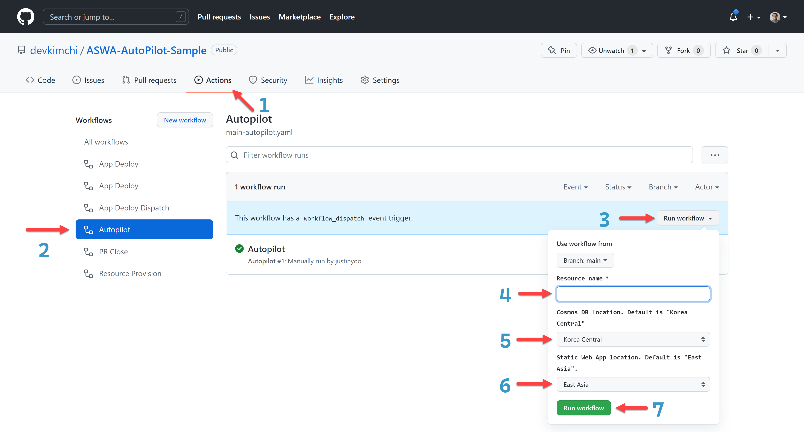
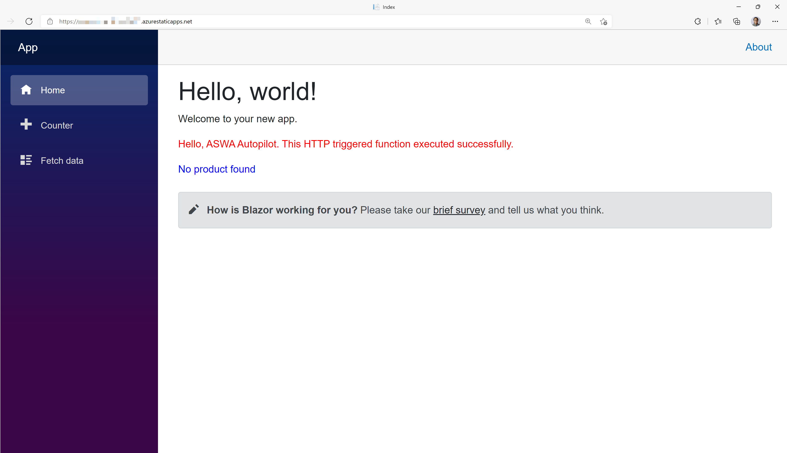

# ASWA AutoPilot Sample #

This provides sample GitHub Actions workflows and Bicep files for devs to autopilot Azure Static Web Apps from resource provisioning to app deployment in just one mouse click.


## Getting Started ##

### Auto-Pilot via Azure Portal ###

Make sure that the autopilot through Azure Portal only provision resources.

[](https://portal.azure.com/#create/Microsoft.Template/uri/https%3A%2F%2Fraw.githubusercontent.com%2Fdevkimchi%2FASWA-AutoPilot-Sample%2Fmain%2Finfra%2Fazuredeploy.json)

Then, run the following PowerShell script to deploy the app:

```pwsh
./infra/Deploy-App.ps1
```

> **NOTE**: You need [GitHub CLI](https://cli.github.com) to run the PowerShell script.

OH WAIT! IT'S TWO STEPS!

Don't worry. Here's another one for you.


### Auto-Pilot via GitHub Actions ###

To run this autopilot through GitHub Actions, you need to add the following two secrets to your repository:

* `AZURE_CREDENTIALS` for Azure CLI
  * For more details, read [this document](https://github.com/Azure/login#configure-a-service-principal-with-a-secret).
* `PA_TOKEN` for Azure Static Web App deployment
  * For more details, read [this document](https://docs.github.com/en/authentication/keeping-your-account-and-data-secure/creating-a-personal-access-token).

Once both secrets are ready, then follow the steps below:



1. Go to the "Actions" tab.
2. Click the "Autopilot" tab.
3. Click the "Run workflow" button.
4. Enter the resource name.
5. Choose the Cosmos DB location.
6. Choose the Azure Static Web App location.
7. Click the "Run workflow" button.

Once completed visit the Azure portal, find the newly created resource group, open the Azure Static Web App URL, then you will see the app is automatically provisioned and deployed.


